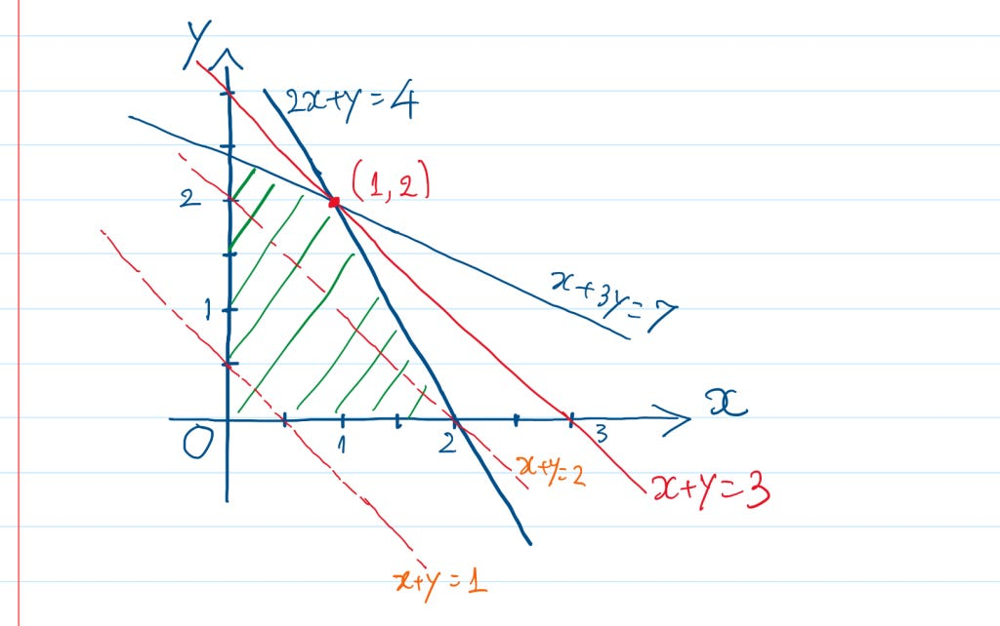

 # Linear Programming


## File Structure
```
   `__init__.py`
   `graphical_method.py`
   `simplex_method.py`
   `transportation_problem.py`
   `assignment_problem.py`
```
## Requirements

To use this repository, you need to have the following dependencies installed. You can install them using:

```
pip install -r requirements.txt
```

## Examples

Check out the [Examples.ipynb](https://github.com/ragu8/Linear-Programming/blob/main/Examples.ipynb) notebook for sample code.

##### Minimization problem (Graphical Method)

```
constraints_min = np.array([[2, 1, 10], [1, 3, 18], [3, 1, 15]])
objective_function_min = [5, 4, 0] 
graphical_method(constraints_min, objective_function_min, 'min')
```
##### Maximization problem (Graphical Method)

```
constraints_max = np.array([[-1, 2, 4], [3, 1, 6], [1, -1, 3]])
objective_function_max = [3, 20, 0]  
graphical_method(constraints_max, objective_function_max, 'max')

```
##### Minimization problem (Simplex Method)

```
Objective_Function = np.array([-3, -2, 0])  
constraints = np.array([[2, 1, 0], [-4, 5, 0], [-1, -2, 0]]) 
RHS = np.array([20, -10, 5])  
simplex(Objective_Function, constraints, RHS, maximize = False, plot_3d = True)

```
##### Maximization problem (Simplex Method)

```
Objective_Function = np.array([-3, -2, 0])  
constraints = np.array([[2, 1, 0], [-4, 5, 0], [-1, -2, 0]]) 
RHS = np.array([20, -10, 5])  
simplex(Objective_Function, constraints, RHS, maximize=True, plot_3d = False)
```
##### Transportation Problem

```
cost_matrix = [
    [2, 2, 2, 1, 4],
    [10, 8, 5, 4, 6],
    [7, 6, 6, 8, 6]
]
supply = [30, 70, 50]
demand = [40, 30, 40, 20, 20]
transportation(supply, demand, cost_matrix)
```
##### Assignment Problem

```
cost_matrix = np.array([
    [8, 6, 7, 3, 4, 5],
    [4, 8, 5, 7, 3, 7],
    [2, 5, 1, 6, 8, 9],
    [1, 6, 7, 8, 4, 9],
    [3, 8, 5, 7, 5, 1],
    [6, 5, 1, 5, 6, 4],  
])
assignment(cost_matrix)

```

